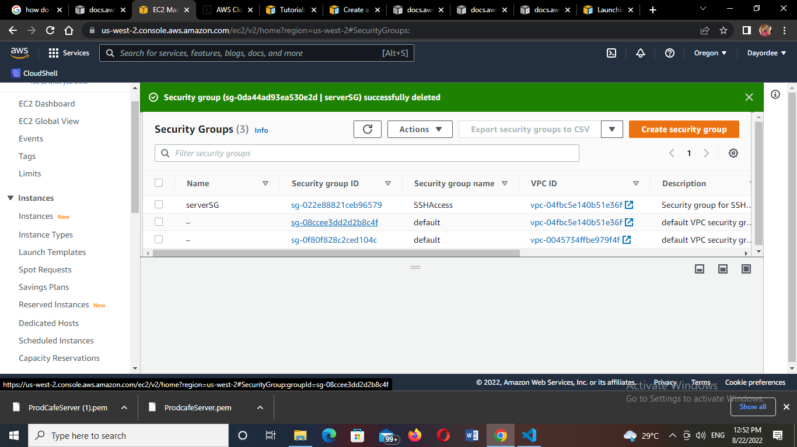

## Launch an Amazon linux instance using AWS CLI

Tasks:

Launch an instance with the following property 
1. instance OS   - Amzon linux
2. instance type - t2.micro
3. Region: Oregon
4. Network: Lab VPC, Public Subnet
5. Tag:  Key: Name     Value: ProdCafeServer
6. Security Group:  Create a  one named serverSG, with TCP port 22 and port 80 open to anywhere

Hint: Associate an elastic ip with this instance, you will need it in later lab.

Grading tip:  Screenshot major cli output and upload with your step by step answer (AWS describe command can help)

1. Using OREGON as my region

2. I created my VPC which gave me a VPC ID to proceed with. And I also attached my subnets

3. I created my Security group with port 22 and 80 open to anywhere.

4.I selected my virtual machine- Amazon linux 2, and created my keypair- ProdCafeServer

5. I went on to launch my instance with an instance-type t2.micro together with my AMI-ID, security group, subnet and keypair

6.

https://docs.aws.amazon.com/cli/latest/userguide/cli-services-ec2-instances.html

