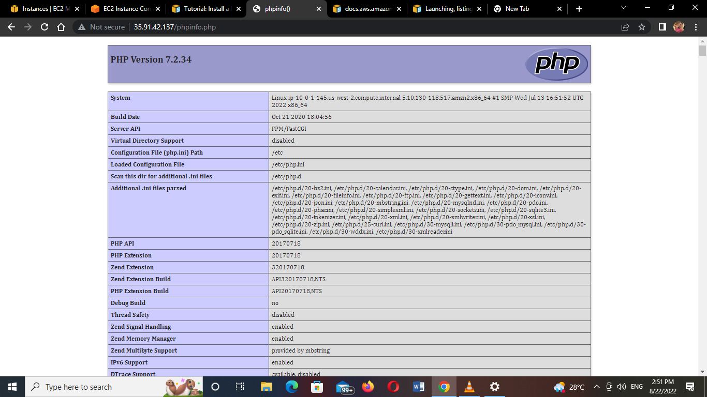
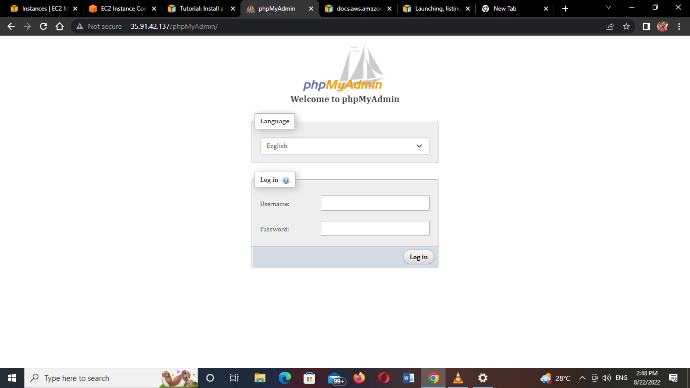
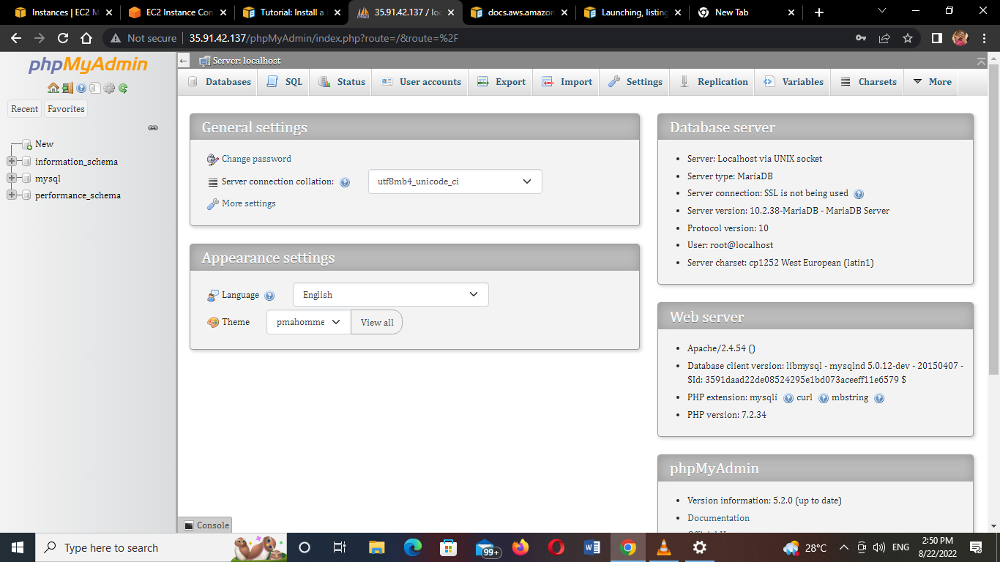
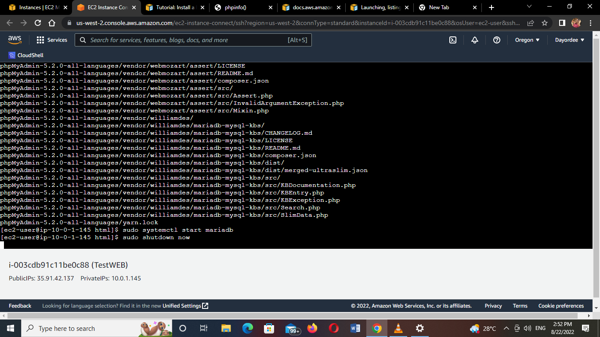

## Install a LAMP web server on Amazon Linux

Tasks:

1. Prepare the LAMP server
2. Test your LAMP server
3. Secure the database server
4. Install phpMyAdmin

Guide: https://docs.aws.amazon.com/AWSEC2/latest/UserGuide/install-LAMP.html

Grading tip:  Screenshot major script outputs and upload with your step by step answer

1. From the previous instance I created

2. I updated my virtual machine

3. I set the permission and logged out and in

4. Here is a list of all I  installed on my Virtual machine

5. I enable my Mariadb (database)

6.I install my PhpMyAdmin and logged-in

I install my LAMP web server on an Amazon Linux 2 virtual machine
I shutdown my virtual machine

