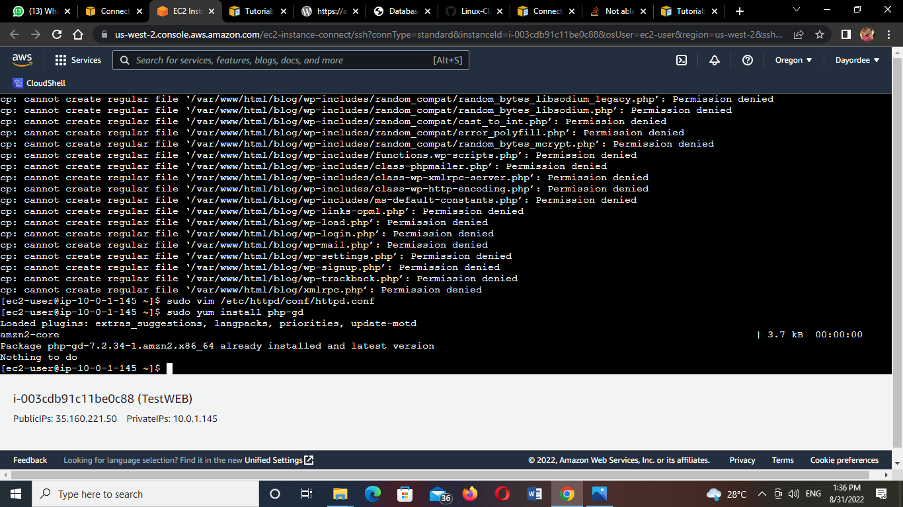

# LAB:  Host a WordPress blog on Amazon Linux 

Task:

1. Download word press installation package.
Input this line of wget command in your shell to install wordpress 

wget https://wordpress.org/latest.tar.gz

2. Create a database user and database for your WordPress installation
3. Create and edit the wp-config.php file (use the guide
4. Install your WordPress files under the Apache document root)
5. Install the PHP graphics drawing library on Amazon Linux 2.
6. Create an AMI of this running instance.
7. Perform clean up operations.

Guide:
https://docs.aws.amazon.com/AWSEC2/latest/UserGuide/hosting-wordpress.html

Grading tip:  Screenshot major script/console outputs and upload with your step by step answer

1. My installation file  and I extracted the file
.png)

3.I started my database  and created a database user for my wordpress installation

4. I created and edited my wp-config.php file

5. I installed PHP on my Amazon Linux 2

I installed all the neccessary files but I don't know where I got it wrong
.png)

.png)